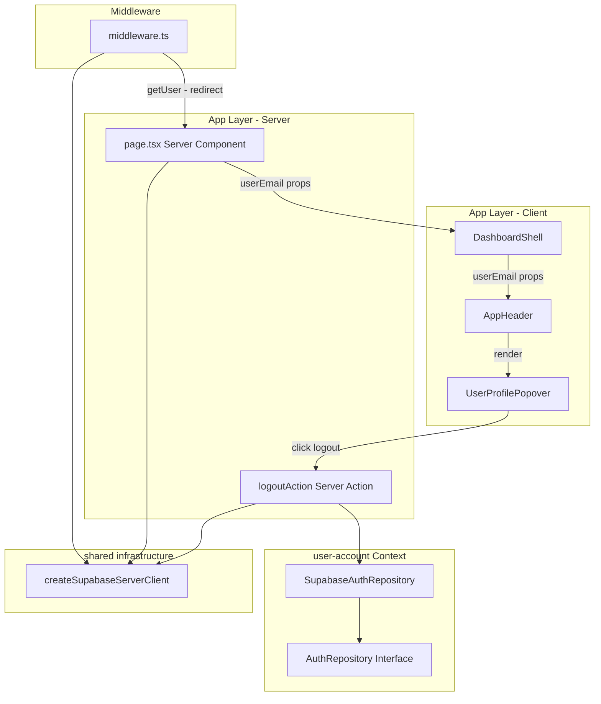
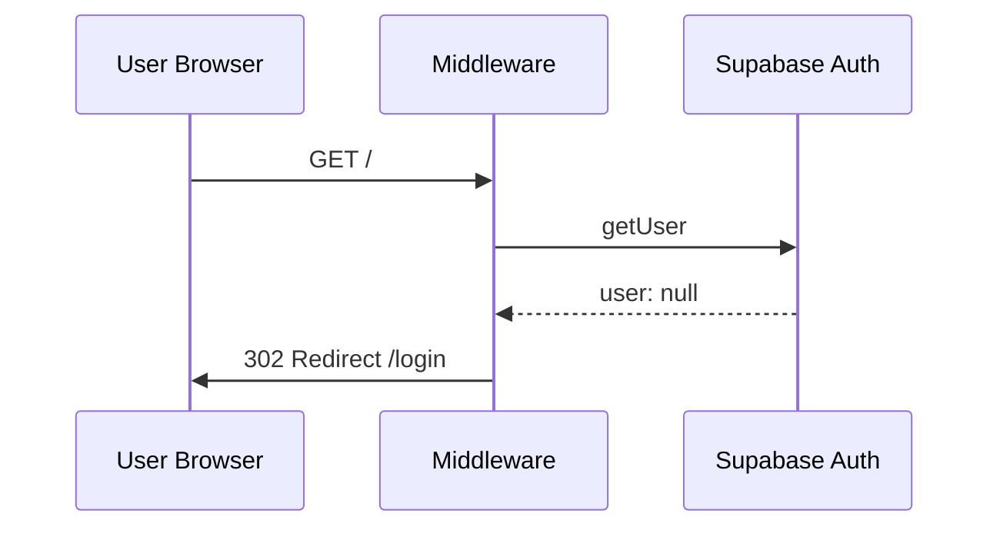
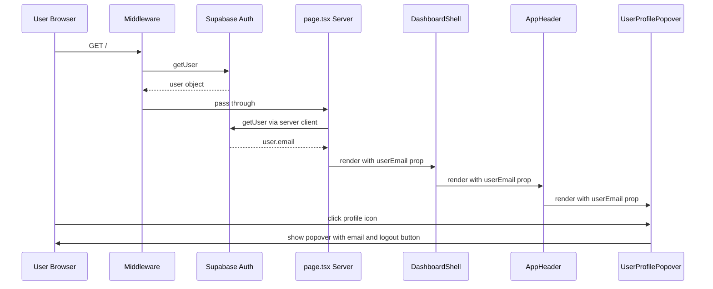
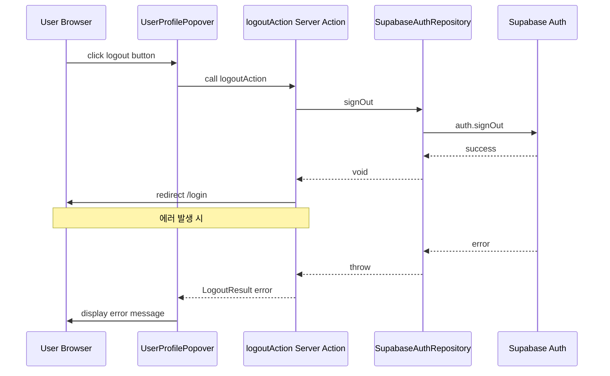

# Technical Design: 루트 페이지 인증 미들웨어

## Overview

**Purpose**: 이 기능은 Eluo Skill Hub의 루트 페이지(`/`)에 인증 가드를 적용하고, 인증 상태에 따른 헤더 UI 분기를 제공하여, 비인증 사용자의 대시보드 접근을 차단하고 인증된 사용자에게 계정 관리 기능을 제공한다.

**Users**: Eluo Skill Hub의 모든 사용자(스킬 소비자, 스킬 제작자, 플랫폼 관리자)가 인증 기반 보호 환경에서 대시보드를 이용한다.

**Impact**: 기존 루트 페이지의 레이아웃 구조(`DashboardShell`)를 유지하면서, 미들웨어에 비인증 사용자 차단 로직을 추가하고, `AppHeader`의 사용자 프로필 아이콘을 대화형 계정 정보 팝오버로 전환한다.

### Goals
- 비인증 사용자의 루트 페이지 접근을 미들웨어 수준에서 차단하여 보안을 강화한다.
- 인증된 사용자에게 프로필 아이콘 기반의 계정 정보 확인 및 로그아웃 기능을 제공한다.
- 서버에서 확인한 인증 정보를 안전하게 클라이언트 컴포넌트에 전달한다.

### Non-Goals
- 사용자 프로필 이미지 업로드 및 표시 기능은 이 범위에 포함하지 않는다.
- 역할 기반 접근 제어(RBAC)는 이 범위에 포함하지 않는다.
- 토큰 갱신 로직의 변경은 포함하지 않는다(기존 미들웨어의 쿠키 갱신 로직을 그대로 유지한다).
- 다수의 보호 경로 추가는 이 범위에 포함하지 않는다(`/`만 대상).

## Architecture

> 디스커버리 결과의 상세 내용은 `research.md`를 참조한다. 모든 결정과 계약은 이 문서에 자체 완결적으로 기록한다.

### Existing Architecture Analysis

- **기존 미들웨어 패턴**: `middleware.ts`가 `@supabase/ssr`의 `createServerClient`를 사용하여 `getUser()`를 호출하고, 인증된 사용자의 auth 페이지 접근 시 `/`로 리다이렉트한다. 비인증 사용자 차단 로직은 없다.
- **기존 도메인 경계**: `user-account` 바운디드 컨텍스트에 `AuthRepository` 인터페이스와 `SupabaseAuthRepository` 구현체가 존재한다. `signOut()` 메서드가 이미 구현되어 있다.
- **기존 UI 구조**: `page.tsx`(서버 컴포넌트) -> `DashboardShell`(클라이언트 컴포넌트) -> `AppHeader`(클라이언트 컴포넌트) 계층 구조이다.
- **기존 Server Action**: `src/app/actions/auth.ts`에 `logoutAction`이 구현되어 있으나, 에러 처리가 없다.
- **기존 UI 라이브러리**: Radix UI 기반 `Popover` 컴포넌트가 `src/shared/ui/components/popover.tsx`에 존재한다.

### Architecture Pattern & Boundary Map



**Architecture Integration**:
- **Selected pattern**: Props Drilling 기반 서버-클라이언트 인증 정보 전달. 컴포넌트 트리 깊이가 2단계로 얕고 소비자가 단일하므로 Context Provider 대비 단순하다.
- **Domain/feature boundaries**: 인증 검증은 미들웨어와 서버 컴포넌트에서 수행하고, UI 표현은 AppHeader/UserProfilePopover에서 담당한다. `user-account` 컨텍스트의 도메인 경계를 존중하여 로그아웃은 `AuthRepository`를 통해 실행한다.
- **Existing patterns preserved**: 기존 미들웨어의 Supabase SSR 클라이언트 생성 패턴, Server Action 패턴, DDD 계층 구조를 유지한다.
- **New components rationale**: `UserProfilePopover`를 별도 컴포넌트로 분리하여 AppHeader의 단일 책임을 유지한다.
- **Steering compliance**: DDD 3계층 원칙 준수, `any` 타입 금지, Aggregate Root를 통한 데이터 변경(AuthRepository), TypeScript strict mode 유지.

### Technology Stack

| Layer | Choice / Version | Role in Feature | Notes |
|-------|------------------|-----------------|-------|
| Frontend | React 19.2.3 / Next.js 16.1.6 | 서버 컴포넌트에서 인증 정보 조회, 클라이언트 컴포넌트에서 UI 렌더링 | App Router 사용 |
| Frontend | Radix UI (radix-ui 1.4.3) | Popover 컴포넌트 제공 | 기존 설치 완료 |
| Frontend | Lucide React 0.575.0 | 아이콘 (User, LogOut) | 기존 설치 완료 |
| Backend | @supabase/ssr 0.8.x | 미들웨어 및 서버 컴포넌트에서 Supabase Auth 세션 관리 | 기존 설치 완료 |
| Data | Supabase Auth | 사용자 인증 세션 관리 | 기존 인프라 |

## System Flows

### 비인증 사용자 루트 페이지 접근 흐름



### 인증 사용자 루트 페이지 접근 및 프로필 팝오버 흐름



### 로그아웃 흐름



## Requirements Traceability

| Requirement | Summary | Components | Interfaces | Flows |
|-------------|---------|------------|------------|-------|
| 1.1 | 비인증 사용자 루트 페이지 접근 시 /login 리다이렉트 | middleware.ts | - | 비인증 사용자 접근 흐름 |
| 1.2 | 인증 사용자 루트 페이지 정상 표시 | middleware.ts, page.tsx | - | 인증 사용자 접근 흐름 |
| 1.3 | 인증 사용자 auth 페이지 접근 시 / 리다이렉트 | middleware.ts | - | - |
| 1.4 | Supabase Auth 세션 기반 인증 판별 | middleware.ts | - | - |
| 2.1 | 인증 시 프로필 아이콘 활성(클릭 가능) 표시 | AppHeader, UserProfilePopover | AppHeaderProps | 인증 사용자 접근 흐름 |
| 2.2 | 프로필 아이콘에 인증 상태 시각적 표시 | AppHeader, UserProfilePopover | AppHeaderProps | - |
| 3.1 | 프로필 아이콘 클릭 시 팝오버 표시 | UserProfilePopover | UserProfilePopoverProps | 인증 사용자 접근 흐름 |
| 3.2 | 팝오버에 이메일 주소 표시 | UserProfilePopover | UserProfilePopoverProps | - |
| 3.3 | 팝오버에 로그아웃 버튼 포함 | UserProfilePopover | UserProfilePopoverProps | - |
| 3.4 | 팝오버 외부 클릭 시 닫기 | UserProfilePopover | - | - |
| 4.1 | 로그아웃 시 Supabase Auth 세션 종료 | logoutAction, SupabaseAuthRepository | LogoutResult | 로그아웃 흐름 |
| 4.2 | 로그아웃 완료 시 /login 리다이렉트 | logoutAction | LogoutResult | 로그아웃 흐름 |
| 4.3 | 로그아웃 완료 시 클라이언트 인증 상태 초기화 | logoutAction | LogoutResult | 로그아웃 흐름 |
| 4.4 | 로그아웃 오류 시 오류 메시지 표시 | UserProfilePopover, logoutAction | LogoutResult | 로그아웃 흐름 |
| 5.1 | 서버에서 인증 사용자 정보(이메일) 전달 | page.tsx, DashboardShell, AppHeader | DashboardShellProps, AppHeaderProps | 인증 사용자 접근 흐름 |
| 5.2 | 민감 데이터 클라이언트 미노출 | page.tsx | - | - |
| 5.3 | 프로필 영역 로딩 상태 표시 | AppHeader, UserProfilePopover | AppHeaderProps | - |

## Components and Interfaces

| Component | Domain/Layer | Intent | Req Coverage | Key Dependencies (P0/P1) | Contracts |
|-----------|--------------|--------|--------------|--------------------------|-----------|
| middleware.ts | Infrastructure | 비인증 사용자 보호 경로 차단 및 인증 사용자 auth 페이지 리다이렉트 | 1.1, 1.2, 1.3, 1.4 | @supabase/ssr (P0) | - |
| page.tsx | App Layer (Server) | 서버에서 인증 정보를 조회하여 클라이언트 컴포넌트에 전달 | 5.1, 5.2 | createSupabaseServerClient (P0) | - |
| DashboardShell | App Layer (Client) | userEmail props를 AppHeader에 전달하는 중간 계층 | 5.1 | AppHeader (P0) | State |
| AppHeader | App Layer (Client) | 인증 상태에 따른 프로필 아이콘 활성화 및 UserProfilePopover 렌더링 | 2.1, 2.2, 5.1, 5.3 | UserProfilePopover (P1) | State |
| UserProfilePopover | App Layer (Client) | 계정 정보 팝오버 표시, 이메일 표시, 로그아웃 버튼 제공 | 3.1, 3.2, 3.3, 3.4, 4.1, 4.2, 4.3, 4.4 | Popover (P0), logoutAction (P0) | Service, State |
| logoutAction | App Layer (Server Action) | Supabase Auth 세션 종료 및 리다이렉트, 에러 처리 | 4.1, 4.2, 4.3, 4.4 | SupabaseAuthRepository (P0) | Service |

### Infrastructure Layer

#### middleware.ts (수정)

| Field | Detail |
|-------|--------|
| Intent | 비인증 사용자의 보호 경로 접근을 차단하고, 인증 사용자의 auth 페이지 접근을 리다이렉트한다 |
| Requirements | 1.1, 1.2, 1.3, 1.4 |

**Responsibilities & Constraints**
- 모든 비정적 자산 요청에 대해 Supabase Auth 세션을 검증한다.
- 비인증 사용자가 보호 경로(`/`)에 접근하면 `/login`으로 리다이렉트한다.
- 인증 사용자가 auth 페이지(`/login`, `/signup`)에 접근하면 `/`로 리다이렉트한다(기존 동작 유지).
- `getUser()`만 사용하여 토큰을 검증한다(`getSession()` 사용 금지).

**Dependencies**
- External: `@supabase/ssr` `createServerClient` -- Supabase 서버 클라이언트 생성 (P0)

**Contracts**: Service [ ] / API [ ] / Event [ ] / Batch [ ] / State [ ]

**Implementation Notes**
- Integration: 기존 미들웨어 코드에 `if (!user && !isAuthPage)` 조건 분기를 추가한다. auth 페이지 경로 목록은 상수로 관리한다.
- Validation: `getUser()` 반환값의 `user` 객체 null 여부로 인증 상태를 판별한다.
- Risks: 미들웨어 matcher 패턴이 정적 자산을 이미 제외하고 있으므로 추가 변경은 불필요하다.

### App Layer (Server)

#### page.tsx (수정)

| Field | Detail |
|-------|--------|
| Intent | 서버에서 인증된 사용자 정보를 조회하여 클라이언트 컴포넌트에 안전하게 전달한다 |
| Requirements | 5.1, 5.2 |

**Responsibilities & Constraints**
- `async` 서버 컴포넌트로 전환하여 `createSupabaseServerClient().auth.getUser()`를 호출한다.
- 사용자 이메일만 추출하여 `DashboardShell`에 전달한다.
- 토큰, 비밀번호 등 민감 정보는 클라이언트에 노출하지 않는다.
- 미들웨어가 비인증 사용자를 이미 차단하므로, 이 컴포넌트에 도달하는 사용자는 항상 인증 상태이다.

**Dependencies**
- Outbound: `createSupabaseServerClient` -- 서버 Supabase 클라이언트 생성 (P0)
- Outbound: `DashboardShell` -- userEmail props 전달 (P0)

**Contracts**: Service [ ] / API [ ] / Event [ ] / Batch [ ] / State [ ]

**Implementation Notes**
- Integration: 기존 동기 함수 컴포넌트를 `async` 서버 컴포넌트로 변환한다.
- Risks: 미들웨어와 page.tsx에서 `getUser()`를 각각 호출하므로 Supabase Auth 서버에 두 번 요청이 발생한다. 현재 단계에서는 수용 가능한 수준이다.

#### logoutAction (수정)

| Field | Detail |
|-------|--------|
| Intent | Supabase Auth 세션을 종료하고 로그인 페이지로 리다이렉트하며, 실패 시 에러 정보를 반환한다 |
| Requirements | 4.1, 4.2, 4.3, 4.4 |

**Responsibilities & Constraints**
- `SupabaseAuthRepository.signOut()`을 호출하여 세션을 종료한다.
- 성공 시 `/login`으로 리다이렉트한다.
- 실패 시 `LogoutResult` 에러 객체를 반환하여 클라이언트에서 오류 메시지를 표시할 수 있게 한다.
- `redirect()`는 try-catch 외부에서 호출하여 Next.js의 NEXT_REDIRECT 에러 충돌을 방지한다.

**Dependencies**
- Outbound: `SupabaseAuthRepository` -- signOut 호출 (P0)
- Outbound: `createSupabaseServerClient` -- 서버 Supabase 클라이언트 생성 (P0)

**Contracts**: Service [x] / API [ ] / Event [ ] / Batch [ ] / State [ ]

##### Service Interface

```typescript
type LogoutResult =
  | { status: 'success' }
  | { status: 'error'; message: string };

function logoutAction(): Promise<LogoutResult>;
```

- Preconditions: 호출자가 인증된 상태이다.
- Postconditions: 성공 시 Supabase Auth 세션이 종료되고 `/login`으로 리다이렉트된다. 실패 시 `LogoutResult` 에러 객체가 반환된다.
- Invariants: `redirect()`는 try-catch 블록 외부에서 호출한다.

### App Layer (Client)

#### DashboardShell (수정) -- Summary Only

| Field | Detail |
|-------|--------|
| Intent | userEmail props를 수신하여 AppHeader에 전달하는 중간 계층 |
| Requirements | 5.1 |

**Implementation Notes**
- Integration: `DashboardShellProps` 인터페이스에 `userEmail` 프로퍼티를 추가하고, `AppHeader`에 전달한다. 기존 `useDashboardState()` 훅과의 관계에는 변경이 없다.

#### AppHeader (수정)

| Field | Detail |
|-------|--------|
| Intent | 인증 상태에 따라 프로필 아이콘을 활성화하고 UserProfilePopover를 렌더링한다 |
| Requirements | 2.1, 2.2, 5.1, 5.3 |

**Responsibilities & Constraints**
- `userEmail` props가 존재하면 프로필 아이콘을 클릭 가능한 버튼으로 렌더링한다.
- 인증 상태를 시각적으로 구분하기 위해 프로필 아이콘에 활성 상태 스타일(예: 강조 색상 테두리)을 적용한다.
- `userEmail`이 로딩 중(undefined)인 경우 프로필 영역에 로딩 상태를 표시한다.

**Dependencies**
- Inbound: DashboardShell -- userEmail props 수신 (P0)
- Outbound: UserProfilePopover -- 팝오버 렌더링 위임 (P1)

**Contracts**: Service [ ] / API [ ] / Event [ ] / Batch [ ] / State [x]

##### State Management

```typescript
interface AppHeaderProps {
  readonly pageTitle: string;
  readonly searchQuery: string;
  readonly onSearchChange: (query: string) => void;
  readonly isMobile: boolean;
  readonly onToggleMobileMenu: () => void;
  readonly userEmail: string;
}
```

- State model: `userEmail`을 서버 컴포넌트로부터 props로 수신한다. 로컬 상태 변경 없음.
- Persistence & consistency: 서버에서 조회한 값이므로 페이지 로드 시 한 번 설정된다.
- Concurrency strategy: 해당 없음. 단방향 데이터 흐름.

**Implementation Notes**
- Integration: 기존 `AppHeaderProps`에 `userEmail` 프로퍼티를 추가한다. 기존 프로필 아이콘 `<div>`를 `UserProfilePopover` 컴포넌트로 교체한다.
- Validation: `userEmail`은 미들웨어가 인증을 보장하므로 항상 유효한 문자열이다.

#### UserProfilePopover (신규)

| Field | Detail |
|-------|--------|
| Intent | 프로필 아이콘 클릭 시 사용자 이메일과 로그아웃 버튼을 포함한 팝오버를 표시한다 |
| Requirements | 3.1, 3.2, 3.3, 3.4, 4.1, 4.2, 4.3, 4.4 |

**Responsibilities & Constraints**
- Radix UI Popover를 사용하여 프로필 아이콘 클릭 시 팝오버를 표시한다.
- 팝오버 내부에 사용자 이메일과 로그아웃 버튼을 렌더링한다.
- 로그아웃 버튼 클릭 시 `logoutAction`을 호출한다.
- 로그아웃 처리 중 로딩 상태를 표시하고, 에러 발생 시 오류 메시지를 팝오버 내부에 표시한다.
- 팝오버 외부 클릭 시 자동으로 닫힌다(Radix UI Popover 기본 동작).

**Dependencies**
- External: Radix UI Popover (`src/shared/ui/components/popover.tsx`) -- 팝오버 UI 제공 (P0)
- External: logoutAction (`src/app/actions/auth.ts`) -- 로그아웃 Server Action 호출 (P0)
- External: Lucide React -- User, LogOut 아이콘 (P2)

**Contracts**: Service [x] / API [ ] / Event [ ] / Batch [ ] / State [x]

##### Service Interface

```typescript
interface UserProfilePopoverProps {
  readonly userEmail: string;
}
```

- Preconditions: `userEmail`은 빈 문자열이 아닌 유효한 이메일 문자열이다.
- Postconditions: 팝오버 내부에 이메일과 로그아웃 버튼이 렌더링된다.

##### State Management

```typescript
interface UserProfilePopoverState {
  isLoggingOut: boolean;
  logoutError: string | null;
}
```

- State model: `isLoggingOut`은 로그아웃 진행 중 여부, `logoutError`는 로그아웃 실패 시 에러 메시지를 관리한다.
- Persistence & consistency: 컴포넌트 로컬 상태. 팝오버가 닫히면 에러 상태가 초기화된다.
- Concurrency strategy: 로그아웃 진행 중 버튼을 비활성화하여 중복 호출을 방지한다.

**Implementation Notes**
- Integration: `src/shared/ui/components/user-profile-popover.tsx`에 생성한다. Popover, PopoverTrigger, PopoverContent를 사용한다.
- Validation: 로그아웃 버튼 클릭 시 `isLoggingOut` 상태를 확인하여 중복 호출을 방지한다.
- Risks: Radix UI Popover가 Portal로 렌더링되므로 z-index가 다른 오버레이(모바일 메뉴 등)와 충돌할 수 있다. z-50 클래스가 이미 적용되어 있으므로 문제가 되지 않을 것으로 예상한다.

## Data Models

### Domain Model

이 기능은 새로운 도메인 엔티티나 애그리게이트를 생성하지 않는다. 기존 `user-account` 컨텍스트의 `AuthRepository` 인터페이스를 그대로 활용한다.

- **Value Objects**: 기존 `EluoDomainEmail` 값 객체를 통해 이메일 도메인 검증이 이미 수행된다(로그인 시).
- **Repository**: 기존 `AuthRepository.signOut()` 메서드를 사용한다.

### Data Contracts & Integration

**서버-클라이언트 데이터 전달**

서버 컴포넌트에서 클라이언트로 전달하는 데이터는 다음으로 제한한다:

```typescript
// page.tsx에서 DashboardShell로 전달하는 데이터
interface AuthenticatedUserData {
  readonly email: string; // 사용자 이메일 (예: "user@eluocnc.com")
}
```

전달하지 않는 데이터:
- `access_token`, `refresh_token` -- 쿠키로만 관리
- `password` -- 서버에서도 평문으로 저장하지 않음
- `id` (UUID) -- 현재 UI에서 불필요
- `user_metadata` -- 현재 요구사항에 불필요

**LogoutResult 계약**

```typescript
type LogoutResult =
  | { status: 'success' }
  | { status: 'error'; message: string };
```

## Error Handling

### Error Strategy

이 기능에서 발생 가능한 에러는 로그아웃 실패와 인증 정보 조회 실패 두 가지로 제한한다.

### Error Categories and Responses

**User Errors**:
- 비인증 상태에서 보호 경로 접근 -- 미들웨어가 `/login`으로 리다이렉트 (사용자에게 에러 표시 없음)

**System Errors**:
- 로그아웃 중 네트워크/서버 오류 -- `LogoutResult` 에러 객체를 반환하여 팝오버 내부에 "로그아웃 처리 중 오류가 발생했습니다. 다시 시도해주세요." 메시지 표시
- `getUser()` 호출 실패 (미들웨어) -- `user`가 null로 반환되어 비인증으로 처리, `/login`으로 리다이렉트
- `getUser()` 호출 실패 (page.tsx) -- 미들웨어가 이미 인증을 보장하므로 발생 가능성 낮음. 발생 시 이메일 빈 문자열 처리

## Testing Strategy

### Unit Tests
- `logoutAction`: 성공 시 `/login` 리다이렉트, 실패 시 에러 객체 반환 검증
- `UserProfilePopover`: 이메일 표시, 로그아웃 버튼 렌더링, 에러 메시지 표시 검증
- `AppHeader`: `userEmail` props에 따른 프로필 아이콘 활성 상태 렌더링 검증

### Integration Tests
- 미들웨어: 비인증 사용자 `/` 접근 시 `/login` 리다이렉트 검증
- 미들웨어: 인증 사용자 `/login` 접근 시 `/` 리다이렉트 검증
- page.tsx -> DashboardShell -> AppHeader: userEmail props 전달 검증

### E2E Tests (Playwright)
- 비인증 상태에서 `/` 접근 시 `/login`으로 리다이렉트되는 전체 흐름 검증
- 인증 후 프로필 아이콘 클릭 -> 팝오버에 이메일 표시 -> 로그아웃 -> `/login` 리다이렉트 전체 흐름 검증
- 팝오버 외부 클릭 시 닫힘 동작 검증

## Security Considerations

- **인증 토큰 검증**: `getUser()`만 사용하여 Supabase Auth 서버에서 토큰을 재검증한다. `getSession()`은 토큰 재검증을 보장하지 않으므로 사용하지 않는다.
- **민감 정보 보호**: 클라이언트에는 이메일만 전달하고, access_token, refresh_token, password 등은 노출하지 않는다. 토큰은 HTTP-Only 쿠키로만 관리된다.
- **CSRF 방지**: Server Action은 Next.js의 내장 CSRF 보호 메커니즘을 활용한다.
- **세션 무효화**: 로그아웃 시 서버 측에서 Supabase Auth 세션을 종료하고, 클라이언트 측 쿠키가 미들웨어에 의해 자동 정리된다.
