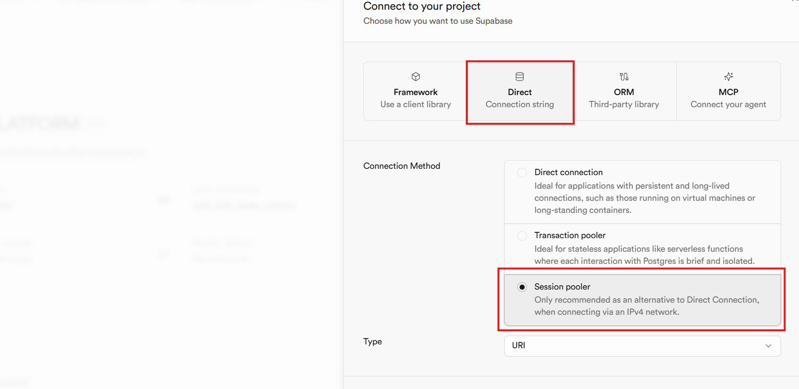
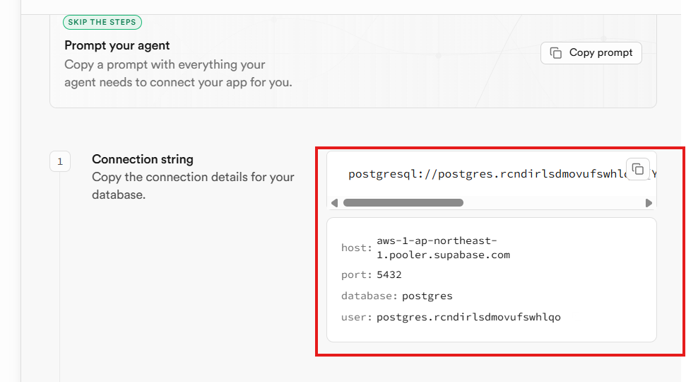
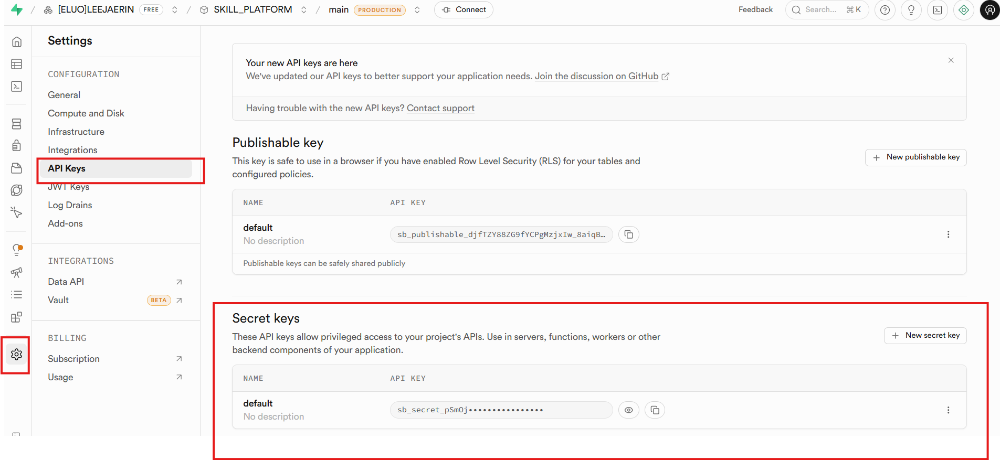
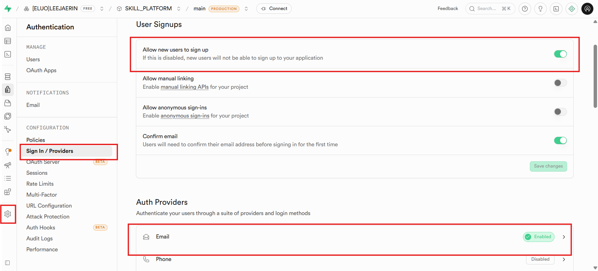
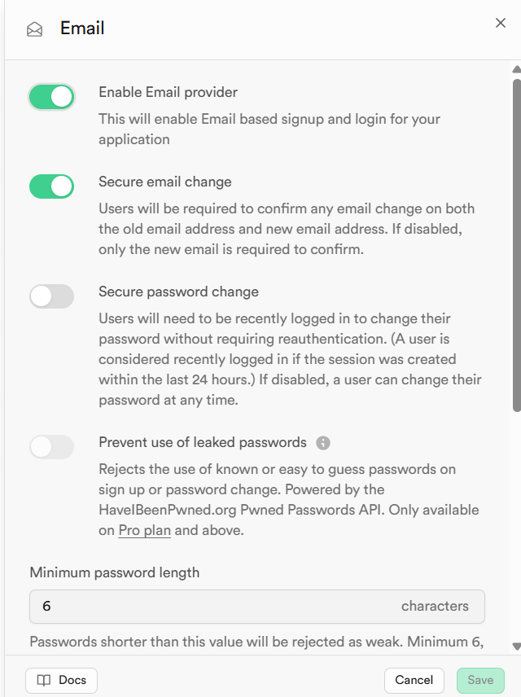
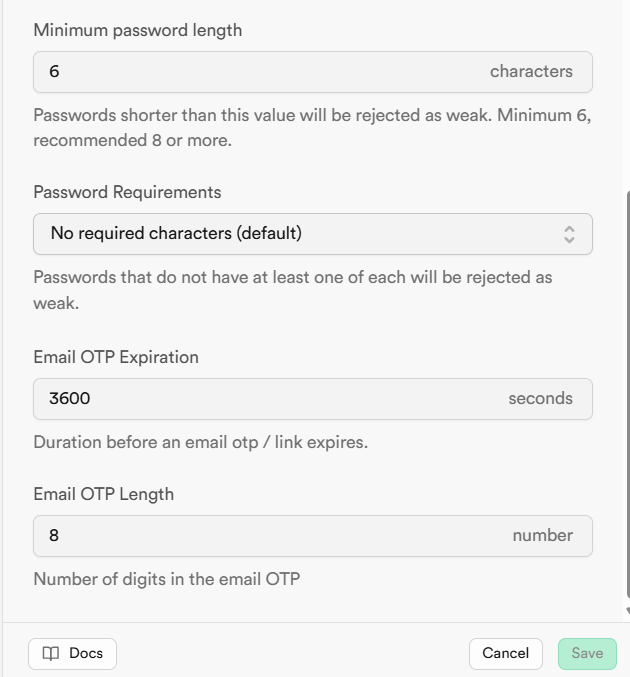
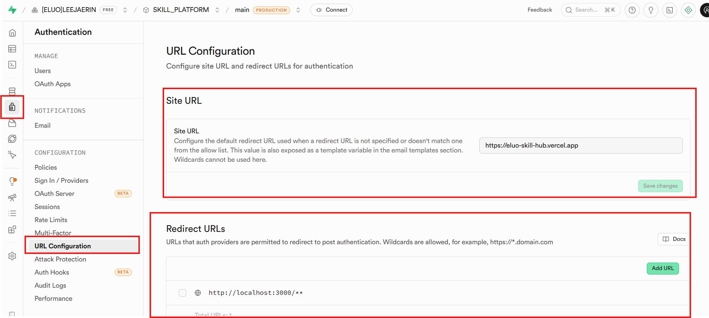
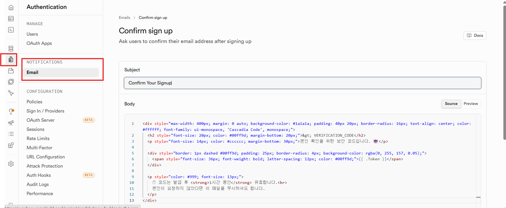
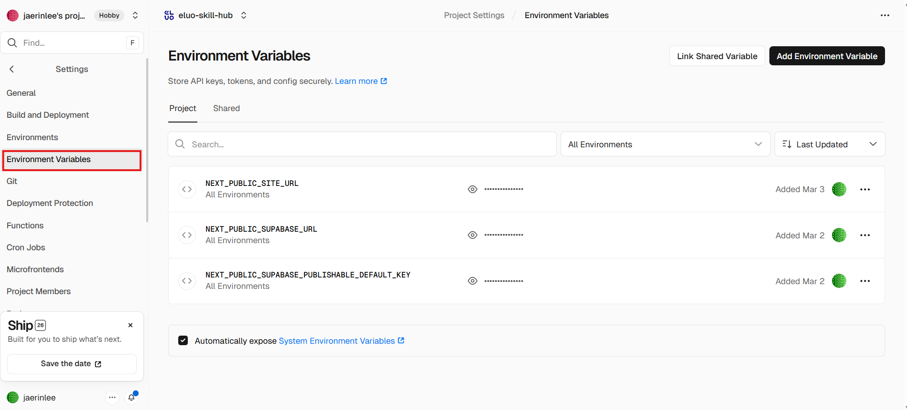

# Eluo Skill Hub - 마이그레이션 인수인계서

> 작성일: 2026-03-24
> 대상: GitHub 저장소 + Supabase 프로젝트 + Vercel 배포 전체 이전

---

## 목차

1. [Supabase 프로젝트 이전](#1-supabase-프로젝트-이전)
2. [Vercel 배포 이전](#2-vercel-배포-이전)
3. [환경 변수 전체 목록](#3-환경-변수-전체-목록)
4. [로컬 개발 환경 셋업](#4-로컬-개발-환경-셋업)
5. [테스트 실행 방법](#5-테스트-실행-방법)
6. [주의사항 및 트러블슈팅](#6-주의사항-및-트러블슈팅)

---

## 1. Supabase 프로젝트 이전

### 1.1 새 프로젝트 생성

1. [Supabase Dashboard](https://supabase.com/dashboard)에서 **New Project** 클릭
2. 설정:
   - **Organization**: 새 계정의 조직 선택
   - **Project name**: `eluo-skill-hub` (또는 원하는 이름)
   - **Database Password**: 설정 후 **반드시 메모** (마이그레이션 스크립트에서 사용)
   - **Region**: `Northeast Asia (Seoul)` 권장
3. **Create new project** 클릭

### 1.2 DB 연결 정보 확인 (Session Pooler)

프로젝트 생성 후 **Connect to your project** 화면에서 연결 정보를 확인합니다.

**Direct Connection** 탭에서 **Session pooler**를 선택하세요:



Session pooler 선택 후 표시되는 연결 정보를 메모합니다:



필요한 정보 3가지:

| 항목 | 예시 | 용도 |
|------|------|------|
| **host** | `aws-1-ap-northeast-1.pooler.supabase.com` | `migrate.sh`의 `NEW_HOST` |
| **user** | `postgres.xxxxxxxxxxxx` | `migrate.sh`의 `NEW_USER` |
| **password** | 프로젝트 생성 시 설정한 비밀번호 | `migrate.sh`의 `NEW_PASSWORD` |

또한 **Settings → API**에서 아래 키도 메모합니다:

| 항목 | 용도 |
|------|------|
| **Project URL** | `.env.local`의 `NEXT_PUBLIC_SUPABASE_URL` |
| **anon public key** | `.env.local`의 `NEXT_PUBLIC_SUPABASE_PUBLISHABLE_DEFAULT_KEY` |
| **service_role key** | `migrate-storage.ts`에서 사용 (코드에는 넣지 않음) |

### 1.3 마이그레이션 스크립트 실행

`migration-dump/` 디렉토리에 모든 스크립트가 준비되어 있습니다.
사용자는 **변수 수정 후 실행만** 하면 됩니다.

#### 스크립트 구성

```
migration-dump/
├── migrate.sh              ← 원클릭 실행 (스키마+함수+RLS+데이터 전부)
├── migrate-storage.ts      ← Storage 파일 복사
├── 01_schema.sql           ← 테이블 12개 + 시퀀스 + 인덱스 20개
├── 02_functions.sql        ← 함수 14개 + 트리거 3개
├── 03_rls.sql              ← RLS 정책 48개 + Storage 버킷 2개
├── 04_import_data.sql      ← CSV 데이터 임포트 + 무결성 검증
├── images/                 ← 가이드 이미지
└── *.csv (14개)            ← 기존 DB에서 덤프한 데이터
```

#### Step 1: DB 마이그레이션 실행

Claude Code에게 아래와 같이 요청하세요:

```
DB 마이그레이션 실행해줘.

NEW_HOST="aws-1-ap-northeast-1.pooler.supabase.com"
NEW_USER="postgres.새프로젝트ref"
NEW_PASSWORD="새프로젝트DB비밀번호"

migration-dump/migrate.sh 실행해줘.
```

> 비밀번호 해시까지 완전히 이전되므로, 기존 사용자는 **기존 비밀번호로 그대로 로그인**할 수 있습니다.

#### Step 2: Storage 파일 마이그레이션

기존/새 프로젝트 모두에서 **Secret key (service_role)**가 필요합니다.

**Settings → API Keys → Secret keys**에서 확인:



Claude Code에게 아래와 같이 요청하세요:

```
Storage 파일 마이그레이션 실행해줘.

OLD_SERVICE_KEY="<기존_프로젝트_SERVICE_ROLE_KEY>"
NEW_URL="https://새프로젝트ref.supabase.co"
NEW_SERVICE_KEY="새_프로젝트_secret_key"

migration-dump/migrate-storage.ts 실행해줘.
```

#### Step 3: Auth 설정

Supabase Dashboard → **Authentication → Sign In / Providers**에서 설정합니다.

**Sign In / Providers** 화면에서 아래 항목을 확인합니다:
- **Allow new users to sign up**: 활성화
- **Confirm email**: 활성화 (사용자가 이메일 인증 후 가입 완료)
- **Auth Providers → Email**: Enabled 상태 확인



**Email Provider** 상세 설정:
- **Enable Email provider**: 활성화
- **Secure email change / Secure password change**: 활성화
- **Prevent use of leaked passwords**: 활성화



**OTP 설정**:
- **Minimum password length**: 6
- **Email OTP Expiration**: 3600 seconds
- **Email OTP Length**: 8



**URL Configuration** (Authentication → URL Configuration):



- **Site URL**: 프로덕션 도메인으로 변경 (예: `https://your-domain.com`)
- **Redirect URLs**: `http://localhost:3000/**` 추가 (로컬 개발용), 프로덕션 도메인도 추가

#### Step 4: Email Template 설정

Authentication → **NOTIFICATIONS → Email** → **Confirm sign up**에서 OTP 인증 메일 템플릿을 설정합니다.



- **Subject**: `Confirm Your Signup`
- **Body**: 아래 HTML을 Source 모드에서 붙여넣기

```html
<div style="max-width: 400px; margin: 0 auto; background-color: #1a1a1a; padding: 40px 20px; border-radius: 16px; text-align: center; color: #ffffff; font-family: ui-monospace, 'Cascadia Code', monospace;">
  <h2 style="font-size: 20px; color: #00ff9d; margin-bottom: 20px;">&gt; VERIFICATION_CODE</h2>
  <p style="font-size: 14px; color: #cccccc; margin-bottom: 30px;">본인 확인을 위한 보안 코드입니다. 🤖</p>

  <div style="border: 1px dashed #00ff9d; padding: 25px; border-radius: 4px; background-color: rgba(0, 255, 157, 0.05);">
    <span style="font-size: 36px; font-weight: bold; letter-spacing: 12px; color: #00ff9d;">{{ .Token }}</span>
  </div>

  <p style="color: #999; font-size: 13px;">
    ⏱ 코드는 발급 후 <strong>1시간 동안</strong> 유효합니다.<br>
    본인이 요청하지 않았다면 이 메일을 무시하셔도 됩니다.
  </p>
</div>
```

### 1.4 데이터베이스 상세 스키마 (참고용)

마이그레이션 스크립트(`01_schema.sql` ~ `03_rls.sql`)에 모든 내용이 포함되어 있으므로 수동 실행할 필요는 없습니다. 아래는 참고용 요약입니다.

#### 주요 함수

| 함수명 | 용도 |
|--------|------|
| `is_admin(uuid)` | 관리자 확인 (RLS 정책에서 사용) |
| `handle_new_user()` | 이메일 인증 완료 시 profiles 자동 생성 (UPDATE 트리거) |
| `handle_updated_at()` | skills 수정 시 updated_at 자동 갱신 |
| `generate_skill_code()` | skills 생성 시 skill_code 자동 부여 (시퀀스 기반) |
| `check_email_exists(text)` | 회원가입 시 이메일 중복 확인 |
| `increment_download_count(uuid)` | 템플릿 다운로드 카운트 증가 |
| `get_analytics_overview(timestamptz, timestamptz)` | 분석 개요 (활성 유저, 조회수, 다운로드) |
| `get_daily_trend(timestamptz, timestamptz)` | 일별 트렌드 |
| `get_skill_rankings(timestamptz, timestamptz, int)` | 스킬 랭킹 |
| `get_user_behavior(timestamptz, timestamptz)` | 사용자 행동 분석 |

#### 트리거

| 트리거 | 테이블 | 시점 | 함수 |
|--------|--------|------|------|
| `on_auth_user_email_confirmed` | `auth.users` | AFTER UPDATE | `handle_new_user()` |
| `trg_generate_skill_code` | `skills` | BEFORE INSERT | `generate_skill_code()` |
| `set_skills_updated_at` | `skills` | BEFORE UPDATE | `handle_updated_at()` |

---

## 2. Vercel 배포 이전

### 2.1 새 프로젝트 생성

1. [Vercel Dashboard](https://vercel.com/dashboard)에서 "Add New Project"
2. 이전된 GitHub 저장소 연결
3. Framework Preset: **Next.js** 선택
4. Build Command: `pnpm build` (자동 감지됨)
5. Output Directory: `.next` (기본값)

### 2.2 환경 변수 설정

Vercel Dashboard → **Settings → Environment Variables**에서 아래 3개 변수를 추가합니다.



| 변수명 | 값 |
|--------|-----|
| `NEXT_PUBLIC_SITE_URL` | 프로덕션 도메인 (예: `https://eluo-skill-hub.vercel.app`) |
| `NEXT_PUBLIC_SUPABASE_URL` | 새 Supabase 프로젝트 URL |
| `NEXT_PUBLIC_SUPABASE_PUBLISHABLE_DEFAULT_KEY` | 새 Supabase Publishable key |

### 2.3 Next.js 설정 참고

현재 `next.config.ts` 설정:
```typescript
{
  images: { formats: ['image/avif', 'image/webp'] },
  compress: true,
  poweredByHeader: false,
}
```

별도의 `vercel.json`은 없으며 Vercel 기본 설정을 사용합니다.

---

## 3. 환경 변수 전체 목록

### `.env.local` (로컬 개발 + Vercel)

| 변수 | 설명 | 예시 |
|------|------|------|
| `NEXT_PUBLIC_SUPABASE_URL` | Supabase 프로젝트 URL | `https://xxxxx.supabase.co` |
| `NEXT_PUBLIC_SUPABASE_PUBLISHABLE_DEFAULT_KEY` | Supabase Anon (공개) Key | `sb_publishable_xxxxx` |
| `NEXT_PUBLIC_SITE_URL` | 사이트 기본 URL | `http://localhost:3000` (로컬) / `https://도메인` (프로덕션) |

### `.env.test` (테스트 전용)

| 변수 | 설명 |
|------|------|
| `TEST_USER_EMAIL` | E2E 테스트용 사용자 이메일 |
| `TEST_USER_PASSWORD` | E2E 테스트용 사용자 비밀번호 |

### `.mcp.json` (Claude Code MCP 연동)

Supabase project ref를 새 프로젝트로 변경:
```json
{
  "mcpServers": {
    "supabase": {
      "type": "http",
      "url": "https://mcp.supabase.com/mcp?project_ref=<새_프로젝트_ref>"
    }
  }
}
```

---

## 4. 로컬 개발 환경 셋업

```bash
# 1. 저장소 클론
git clone https://github.com/<새계정>/eluo-skill-hub.git
cd eluo-skill-hub

# 2. pnpm 설치 (없는 경우)
npm install -g pnpm

# 3. 의존성 설치
pnpm install

# 4. 환경 변수 설정
cp .env.local.example .env.local
# .env.local 파일에 새 Supabase 프로젝트 정보 입력

# 5. 개발 서버 실행
pnpm dev
# http://localhost:3000 접속
```

### 관리자 계정 설정

데이터 마이그레이션 시 기존 관리자 계정이 그대로 이전됩니다.
새로 관리자를 추가해야 하는 경우:

1. 일반 사용자로 회원가입 (OTP 인증 완료)
2. Supabase SQL Editor에서 해당 유저의 role을 admin으로 변경:

```sql
UPDATE public.profiles
SET role_id = (SELECT id FROM public.roles WHERE name = 'admin')
WHERE email = '<관리자_이메일>';
```

---

## 5. 테스트 실행 방법

### Unit 테스트 (Jest)

```bash
pnpm test              # 전체 테스트 실행
pnpm test:watch        # Watch 모드
pnpm test:coverage     # 커버리지 리포트
```

### E2E 테스트 (Playwright)

```bash
# 1. Playwright 브라우저 설치 (최초 1회)
npx playwright install

# 2. .env.test 파일에 테스트 계정 정보 설정

# 3. E2E 테스트 실행
pnpm test:e2e

# 4. 리포트 확인
npx playwright show-report
```

Playwright는 로그인 상태를 `.auth/user.json`에 저장하여 재사용합니다.

---

## 6. 주의사항 및 트러블슈팅

### 마이그레이션 관련 문제

| 문제 | 원인 | 해결 |
|------|------|------|
| `migrate.sh` 연결 실패 | 호스트/유저/비밀번호 오류 | Session pooler 연결 정보 재확인 (4.2절 이미지 참고) |
| `pg_dump` 버전 불일치 | 로컬 PostgreSQL 클라이언트가 낮은 버전 | `migrate.sh`는 `psql`의 `\COPY`를 사용하므로 해당 없음 |
| `Tenant or user not found` | Transaction pooler(6543) 사용 또는 잘못된 리전 | **Session pooler**(5432) + 정확한 리전 호스트 확인 |
| IPv6 연결 실패 (WSL) | Direct Connection은 IPv6만 지원 | Session pooler 사용 (IPv4 지원) |
| 복원 시 중복 키 에러 | 이미 데이터가 존재 | 새 프로젝트에서 실행했는지 확인. 재실행 시 테이블 DROP 후 재시도 |
| 복원 후 로그인 실패 | `auth.identities` 누락 | `auth_identities.csv`가 정상 임포트 되었는지 확인 |
| profiles 중복 생성 | 트리거 비활성화 안 됨 | `04_import_data.sql`이 자동으로 처리하므로 `migrate.sh` 통해 실행 |
| Storage 마이그레이션 실패 | service_role key 오류 | Dashboard → Settings → API에서 **service_role** (secret) 키 확인 |

### 서비스 관련 문제

| 문제 | 원인 | 해결 |
|------|------|------|
| ZIP 파일 업로드 실패 | Windows에서 MIME 타입 `application/x-zip-compressed` 전달 | 코드에서 Blob 변환으로 MIME 강제 지정 (이미 처리됨) |
| 회원가입 후 프로필 없음 | `handle_new_user` 트리거 미설정 | `02_functions.sql` 트리거 생성 확인 |
| 관리자 페이지 접근 불가 | RLS 정책 또는 role 미설정 | `is_admin` 함수 + `profiles.role_id` 확인 |
| Storage 업로드 권한 에러 | Storage RLS 정책 미설정 | `03_rls.sql` Storage 정책 확인 |
| 파일명 깨짐 | 한글 파일명 인코딩 | `sanitizeStoragePath` 함수가 비-ASCII 문자 제거 (이미 처리됨) |

### TypeScript 규칙

- `any` 타입 사용 **절대 금지** (ESLint에서 에러 발생)
- strict 모드 필수

### 커밋 컨벤션

```
feat: 새로운 기능 추가          fix: 버그 수정
docs: 문서 수정                style: 코드 스타일 수정
refactor: 코드 리팩토링         test: 테스트 코드 추가/수정
chore: 빌드/툴 변경             ci: CI/CD 관련 변경
```
> prefix는 영어, 설명은 한글로 작성

### 이벤트 로그 타입 목록

| event_name | properties |
|------------|------------|
| `auth.signin` | `{ email }` |
| `auth.signup` | `{ email }` |
| `auth.signout` | `{}` |
| `skill.view` | `{ skill_id }` |
| `skill.bookmark_add` | `{ skill_id }` |
| `skill.bookmark_remove` | `{ skill_id }` |
| `skill.template_download` | `{ skill_id, template_id }` |
| `search.query` | `{ query }` |
| `search.tag` | `{ tag }` |
| `nav.sidebar_click` | `{ tab }` |

### 아키텍처 패턴

프로젝트는 **도메인 중심 구조**를 따릅니다:
- `domain/` - 타입 정의
- `infrastructure/` - Supabase Repository 구현
- `application/` - Use Case (비즈니스 로직)
- `presentation/` - React 컴포넌트
- `hooks/` - React Query 훅

---

## 부록: 기존 Supabase 프로젝트 정보 (참고용)

| 항목 | 값 |
|------|-----|
| Project Ref | `rcndirlsdmovufswhlqo` |
| URL | `https://rcndirlsdmovufswhlqo.supabase.co` |
| Anon Key | `sb_publishable_djfTZY88ZG9fYCPgMzjxIw_8aiqBRf7` |
| Session Pooler Host | `aws-1-ap-northeast-1.pooler.supabase.com` |
| Session Pooler User | `postgres.rcndirlsdmovufswhlqo` |
| Session Pooler Port | `5432` |

> 이전 완료 후 기존 프로젝트의 키는 반드시 교체하거나 프로젝트를 삭제하세요.
